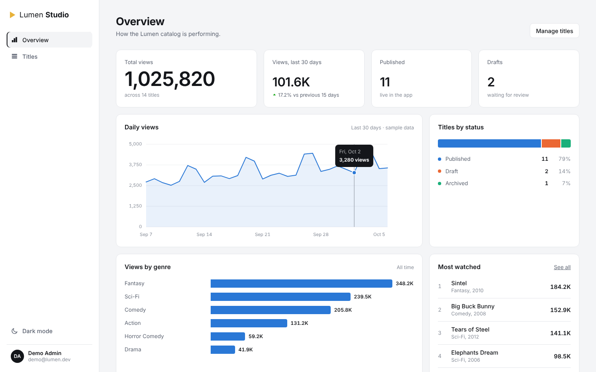
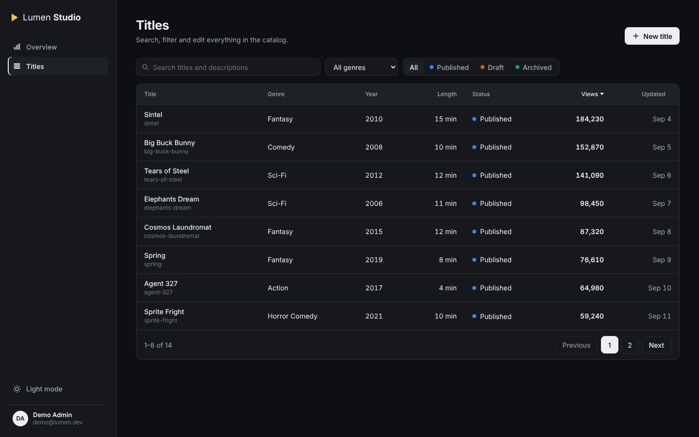
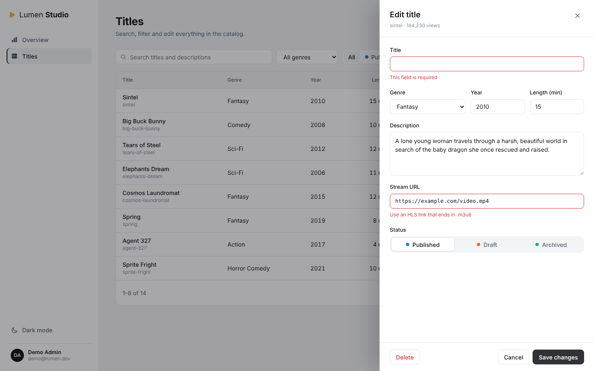

# Lumen Studio

Admin dashboard for the [Lumen TV](https://github.com/guluaketi11/lumen-tv) catalog, built with Angular.

**Live demo:** _add your Vercel link here_



## Features

- **Overview dashboard** with key numbers, a daily views line chart (crosshair tooltip, keyboard navigation with arrow keys), views by genre and titles by status. Charts are hand-built SVG, no chart library.
- **Titles table** with debounced search, genre and status filters, sortable columns and pagination, plus loading, empty and error states.
- **Edit drawer** with a reactive form and clear validation messages (required fields, number ranges, HLS `.m3u8` URL check), create, update and delete with confirmation.
- **Light and dark themes**, remembered between visits.
- **Responsive** down to mobile.
- **Swappable data layer.** By default the app runs on an in-memory mock API with simulated latency, so the demo works without a backend. Set `apiUrl` in `src/environments/environment.ts` to use the real [Lumen API](https://github.com/guluaketi11/lumen-api) instead.

| Titles (dark) | Edit form validation |
| --- | --- |
|  |  |

## Tech stack

Angular 20 (standalone components, signals, new control flow, lazy-loaded routes) · TypeScript · RxJS · Reactive Forms · CSS

## Run locally

```bash
npm install
npm start
```

Open http://localhost:4200. Build for production with `npm run build`.

## Project structure

```
src/app/
  app.ts, app.html        Shell: sidebar, theme toggle, toasts
  catalog-api.ts          CatalogApi with mock and HTTP implementations
  pages/overview/         Dashboard
  pages/titles/           Table, filters, pagination
  components/
    title-form.*          Create / edit drawer
    line-chart.ts         Daily views chart
    bar-list.ts           Views by genre
    status-bar.ts         Titles by status
```

The daily views chart uses generated sample data; everything else comes from the catalog API.
